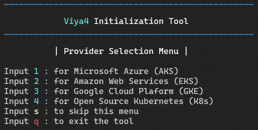

# **SAS Viya 4 Initialization Tool**

## Overview
The viya4-init-tool can fully prepare a bastion host for a SAS Viya 4 cluster creation and management on:
* Microsoft Azure - [viya4-iac-azure](https://github.com/sassoftware/viya4-iac-azure) by [sassoftware](@sassoftware)
* Amazon Web Services - [viya4-iac-aws](https://github.com/sassoftware/viya4-iac-aws) by [sassoftware](@sassoftware)
* Google Cloud Plaform - [viya4-iac-gcp](https://github.com/sassoftware/viya4-iac-gcp) by [sassoftware](@sassoftware)
* Open Source Kubernetes - [viya4-iac-k8s](https://github.com/sassoftware/viya4-iac-k8s) by [sassoftware](@sassoftware)

It's interactive and guides the user through every step of the way asking for input when necessary.
The tool consists of 2 menus which will let the user select the Provider and the Mode desired to then follow a guided process.

### Provider Selection Menu

### Mode Selection Menu

## Requirements

* Sudoer / Root
* Internet access
* Provider admin privileges