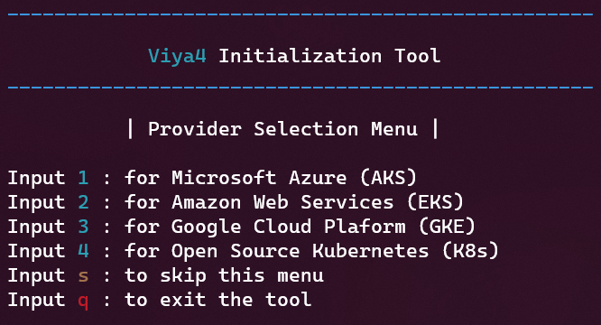
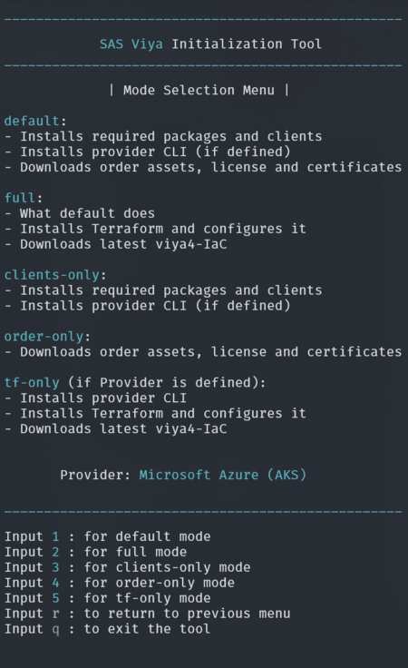

# SAS Viya 4 Initialization Tool

## Overview
The viya4-init-tool can fully prepare a bastion host for a SAS Viya 4 cluster creation and management on:
* Microsoft Azure - @sassoftware [viya4-iac-azure](https://github.com/sassoftware/viya4-iac-azure)
* Amazon Web Services - @sassoftware [viya4-iac-aws](https://github.com/sassoftware/viya4-iac-aws)
* Google Cloud Plaform - @sassoftware [viya4-iac-gcp](https://github.com/sassoftware/viya4-iac-gcp)
* Open Source Kubernetes - @sassoftware [viya4-iac-k8s](https://github.com/sassoftware/viya4-iac-k8s)

It's interactive and guides the user through every step of the way asking for input when necessary.
The tool consists of 2 menus which will let the user select the Provider and the Mode desired to then follow a guided process.

**Provider Selection Menu**

**Mode Selection Menu**

