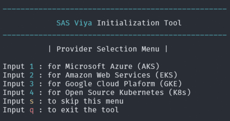

# **SAS Viya 4 Initialization Tool**

## Overview
The viya4-init-tool can fully prepare a bastion host for a SAS Viya 4 cluster creation and management on:
>* Microsoft Azure - [viya4-iac-azure](https://github.com/sassoftware/viya4-iac-azure) by [sassoftware](@sassoftware)
>* Amazon Web Services - [viya4-iac-aws](https://github.com/sassoftware/viya4-iac-aws) by [sassoftware](@sassoftware)
>* Google Cloud Plaform - [viya4-iac-gcp](https://github.com/sassoftware/viya4-iac-gcp) by [sassoftware](@sassoftware)
>* Open Source Kubernetes - [viya4-iac-k8s](https://github.com/sassoftware/viya4-iac-k8s) by [sassoftware](@sassoftware)

It's interactive and guides the user through every step of the way asking for input when necessary.
The tool consists of 2 menus which will let the user select the Provider and the Mode desired to then follow a guided process.

### Provider Selection Menu

### Mode Selection Menu

## Requirements

>* Sudoer / Root
>* Internet access
>* Provider admin privileges

## License

> This project is licensed under the [Apache 2.0 License](LICENSE.md).

## Additional Resources

>* [Kubernetes](https://kubernetes.io/docs/tasks/tools/)
>* [Terraform](https://developer.hashicorp.com/terraform/intro)
>* [jq](https://stedolan.github.io/jq/)
>* [Docker](https://docs.docker.com/)
>* [Helm](https://helm.sh/docs/)
>* [Ansible](https://docs.ansible.com/ansible/2.9/index.html)
>* [Azure CLI](https://learn.microsoft.com/en-us/cli/azure/)
>* [AWS CLI](https://docs.aws.amazon.com/cli/latest/userguide/cli-chap-welcome.html)
>* [gCloud CLI](https://cloud.google.com/sdk/gcloud)
>* [viya4-iac-azure](https://github.com/sassoftware/viya4-iac-azure)
>* [viya4-iac-aws](https://github.com/sassoftware/viya4-iac-aws)
>* [viya4-iac-gcp](https://github.com/sassoftware/viya4-iac-gcp)
>* [viya4-iac-k8s](https://github.com/sassoftware/viya4-iac-k8s)
